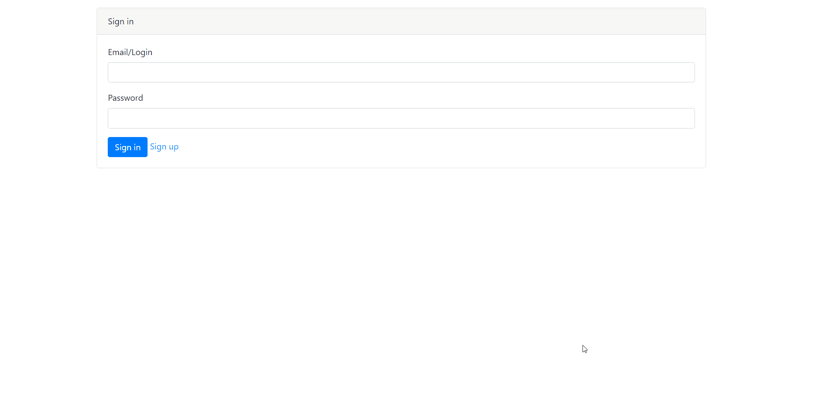
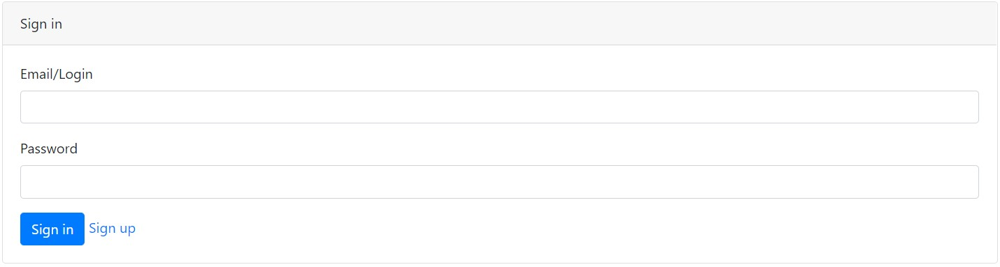
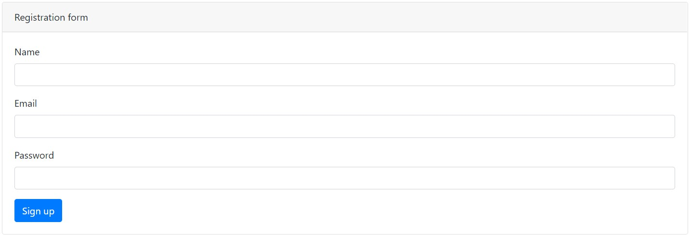
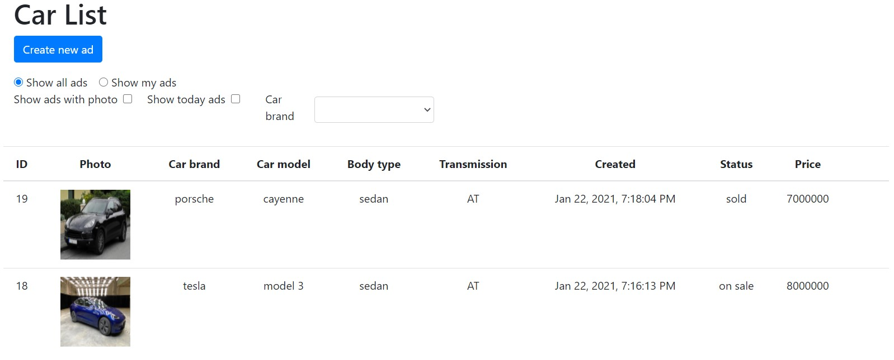
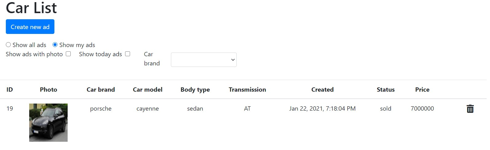
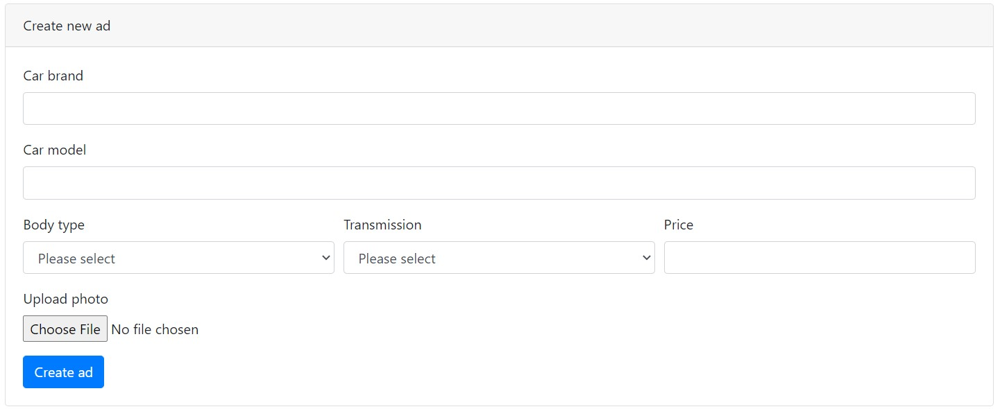
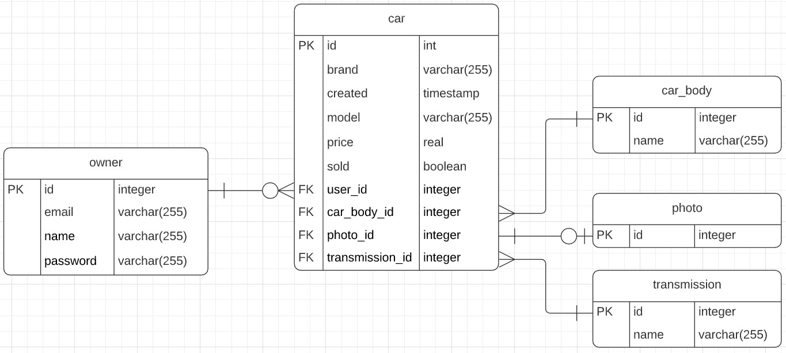

### Car auction
 
[](https://travis-ci.com/denisRudie/job4j_car-auction)
[](https://codecov.io/gh/denisRudie/job4j_car-auction)

### О проекте
Площадка для продажи автомобилей. Построено на html+bootstrap, сервлетах, Postgres + Hibernate
. Позволяет пользователям выставлять свои автомобили на продажу. Объявления сохраняются в БД. Изображения сохраняются на сервере. Клиент с контроллером обмениваются сообщениями в формате JSON.
### Technologies
* Java 14
* Java EE Servlets
* Apache Tomcat
* Hibernate, Postgres
* JS, AJAX, HTML5, Bootstrap (front)
* Gson, json-simple for parsing JSONs
* hsqldb with inMem db - for testing DB
* Maven as a build system
* Travis CI
### Возможности
* Авторизация/регистрация. Доступ только у авторизованных пользователей (реализовано через фильтр). Авторизованный пользователь сохраняется в сессию.
* Добавление автомобилей в список на продажу. Параметры а/м выбираются из справочников. Есть возможность добавить фотографию.
* Удаление своих объявлений из списка.
* Поменять статус объявления на "продано".
* Фильтр для отображения только своих объявлений, фильтры для отображения только объявлений с фото, только за текущую дату, фильтр по марке а/м.
### Demo
Working demo


Login page


Sign Up page


Ads list


My Ads list


Creating page


Data base schema

### REST API
для всех пользователей:

| команда              | запрос                                                                           | ответ                                              
|----------------------|----------------------------------------------------------------------------------|-------------------------|
| авторизация         | POST ```https://sitename/login```  Body: ```{action: "login", email: "John" , pwd: "123"}``` | Код состояния:```200 OR 401``` |
| регистрация         | POST ```https://sitename/login```  Body: ```{action: "new", name: "DENIS", email: "123@mail.ru", pwd: "123"}``` | Код состояния:```200``` |

для авторизированного пользователя:

| команда                                 | запрос                                                                | ответ                                              |
|-----------------------------------------|-----------------------------------------------------------------------|----------------------------------------------------|
| получить справочные данные | GET ```https://sitename/create```                                       | Код состояния:```200``` Header: ```"Content-Type: application/json"```  Body: ```{"bodies":[{"id":4,"name":"sedan"}],"transmissions":[{"id":3,"name":"AT"}]}``` |
| получить список всех объявлений + фильтры | GET ```https://sitename/auction?action=all&withPhoto=true&today=true&brand=porsche```                                       | Код состояния:```200``` Header: ```"Content-Type: application/json"```  Body: ```[{"id":19,"brand":"porsche","model":"cayenne","created":"","owner":{"id":7},"transmission":{"id":3,"name":"AT"},"carBody":{"id":4,"name":"sedan"},"sold":true,"price":7000000.0,"photo":{"id":28}}]``` |
| создать новое объявление | POST ```https://sitename/create```  Body: ```{brand: "kia", model: "ceed", body: "5", transmission: "3", price: "650000"}```                                       | Код состояния:```200``` |
| отметить объявление как завершенное | POST ```https://sitename/auction```  Body: ```{action: "update", id: "21"}```                                       | Код состояния:```200``` |
| удалить объявление | POST ```https://sitename/auction```  Body: ```{action: "delete", id: "53"}```                                       | Код состояния:```200``` |
